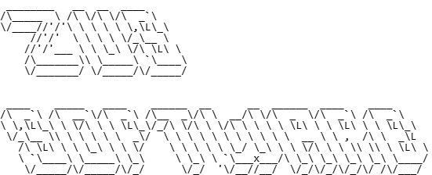

# Cleaner Temp Windows

## Despre
Un utilitar pentru curățarea folderelor temporare din Windows, dezvoltat de Zus Software v.1.0 (2025).



## Caracteristici
- ✅ Interfață prietenoasă cu animație de încărcare
- ✅ Curățare foldere temporare Windows pentru toți utilizatorii
- ✅ Versiuni în VBScript și PowerShell
- ✅ Feedback vizual pentru utilizator
- ✅ Nu necesită instalare

## Capturi de ecran
### Ecranul inițial


### Procesul de încărcare


### Rezultate


## Cum să utilizați
1. Descărcați sau clonați repository-ul
   ```bash
   git clone https://github.com/mcdexters/cleanertempwindows.git
   ```
2. Faceți dublu clic pe `CleanTempFolders.vbs` pentru versiunea cu interfață
3. SAU rulați `CleanTempFolders.ps1` direct cu PowerShell (ca Administrator)

## Componente
Utilitarul include două scripturi principale:

1. **CleanTempFolders.vbs** - Script VBScript
   - Oferă o interfață grafică pentru utilizator
   - Rulează scriptul PowerShell cu drepturi de administrator
   - Afișează un indicator de progres pentru utilizator
   
2. **CleanTempFolders.ps1** - Script PowerShell
   - Efectuează curățarea propriu-zisă a folderelor temporare
   - Curăță folderul Windows Temp (C:\Windows\Temp)
   - Curăță folderele Temp pentru toți utilizatorii (C:\Users\{user}\AppData\Local\Temp)

## Cerințe de sistem
- Windows 10/11
- PowerShell 5.1 sau mai recent
- Drepturi de administrator pentru curățarea folderelor sistem

## Contribuții
Contribuțiile sunt binevenite! Vă rugăm să deschideți un issue sau să trimiteți un pull request.

## Licență
 2025 Zus Software. Toate drepturile rezervate.

## Contact
www.zussoftware.ro
